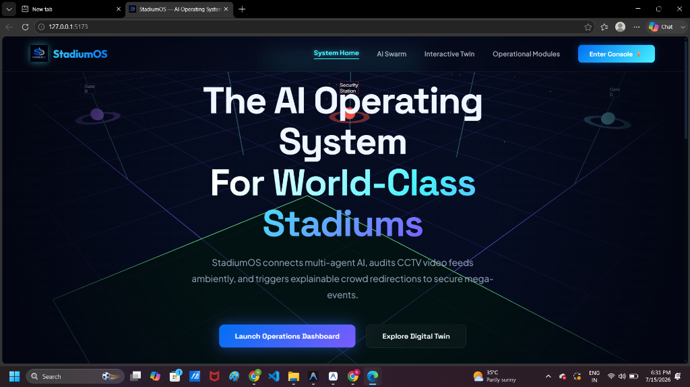
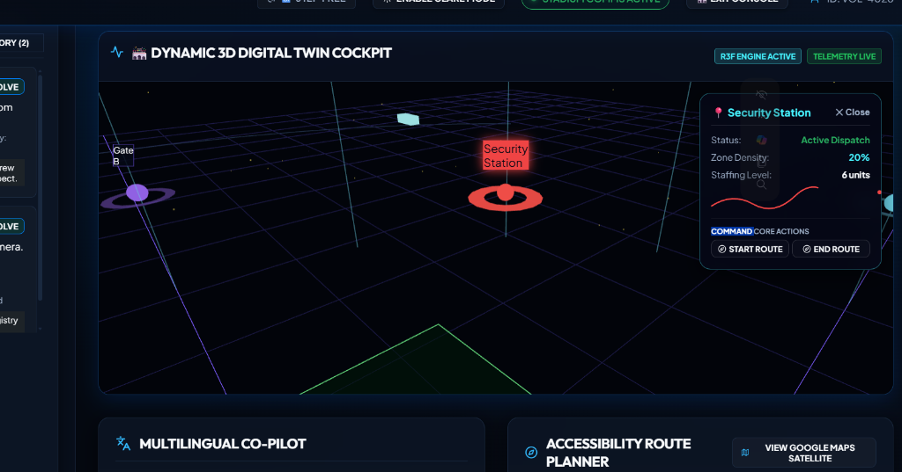
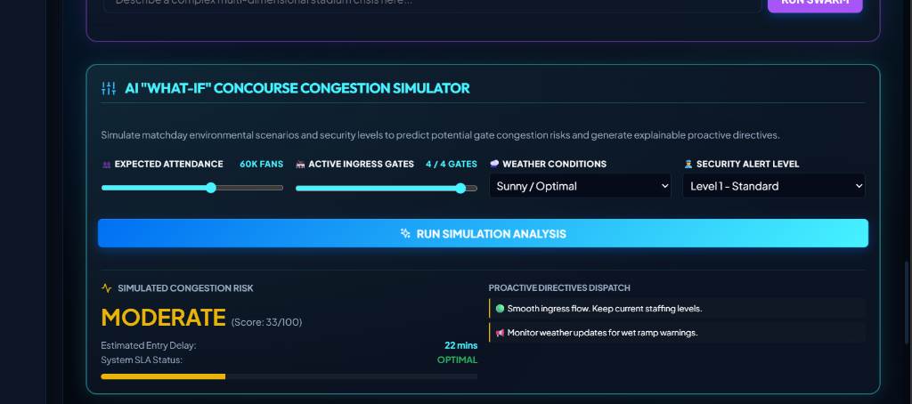
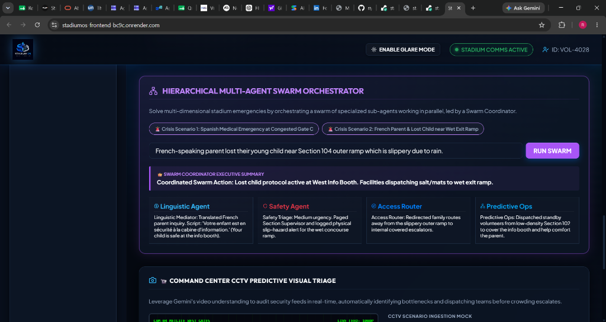
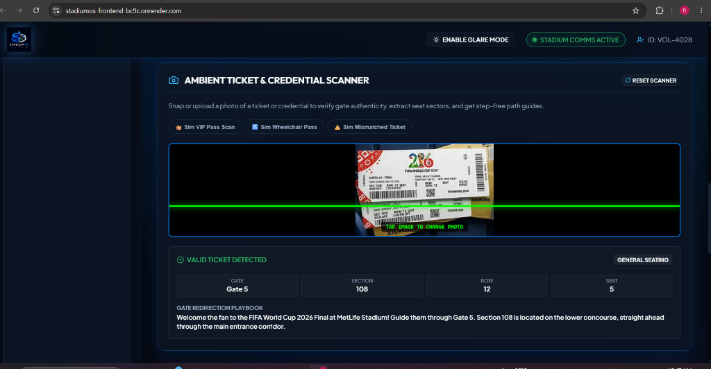
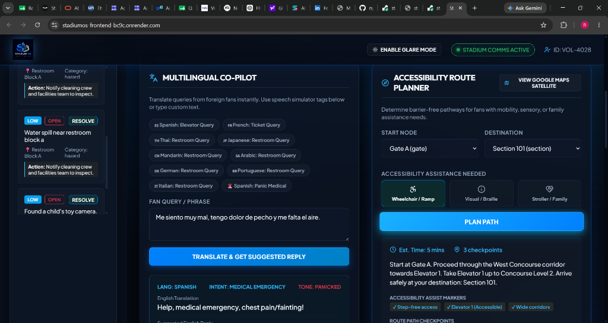
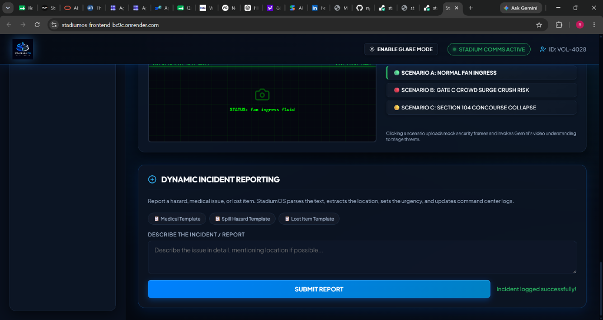
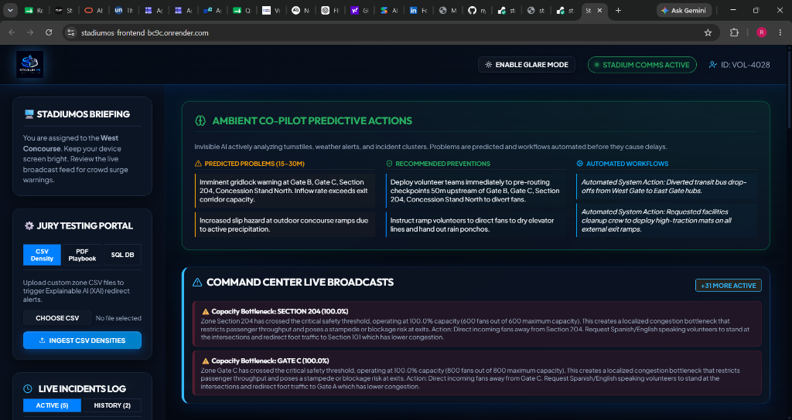

<p align="center">
  
</p>

<p align="center">
  <strong>The AI Operating System for World-Class Stadiums</strong><br>
  <em>Built for FIFA World Cup 2026 — PromptWars Grand Finale</em>
</p>

<p align="center">
  <a href="https://react.dev"></a>
  <a href="https://fastapi.tiangolo.com"></a>
  <a href="https://deepmind.google/gemini"></a>
  <a href="https://threejs.org"></a>
  <br>
  <a href="#"></a>
  <a href="#"></a>
  <a href="#"></a>
</p>

<p align="center">
  <a href="https://github.com/riyanshika7/stadiumOS"><strong>GitHub Repository</strong></a> |
  <a href="https://stadiumos-demo.onrender.com"><strong>Live Demo Link</strong></a>
</p>

---

## Overview

StadiumOS is a **real-time AI operating system** for stadium operations at the FIFA World Cup 2026. It transforms how 80,000+ spectators are managed by placing an intelligent, interconnected AI copilot in the hands of every volunteer and command center operator.

**The core insight**: Stadium operations are messy because information is siloed. Crowd data doesn't talk to routing. Weather doesn't talk to medical. Security doesn't talk to accessibility. StadiumOS breaks every silo.

**One intelligent operating system.** Nine specialized AI agents. One unified mission control dashboard. 20 real-time API endpoints. 35 premium UI components. 117 passing tests.

---

## Problem

Managing a FIFA World Cup stadium introduces colossal operational friction:

| Stakeholder | Pain Point |
|---|---|
| **Volunteers** | Overwhelmed by crowd spikes, language barriers, and no unified tool |
| **Command Center** | No real-time situational awareness across 6+ zones simultaneously |
| **Safety Teams** | Manual triage of CCTV feeds, PDF-based SOPs, no AI assistance |
| **Accessibility Teams** | No dynamic step-free routing that responds to changing congestion |
| **Fans** | Language barriers, confusing navigation, slow incident resolution |
| **Operations** | Weather, transport, security, medical — all managed in separate systems |

### Why Volunteers?
Volunteers are the frontline workforce at any massive sporting event, direct touchpoints for thousands of fans daily. By placing an intelligent, multi-agent AI copilot in the hands of a volunteer:
- **Instant Response**: Overcomes language barriers (8+ languages) and provides tailored, polite de-escalation/assistance scripts instantly.
- **Distributed Intelligence**: Turns every volunteer into an active node in the stadium's intelligence network—logging incidents, identifying bottlenecks, and routing fans dynamically.
- **Reduced Command Burden**: Lowers radio chatter and command center load by solving local problems (lost tickets, directional queries) autonomously using AI.

### Assumptions Made
1. **Connectivity**: Stable local network (Wi-Fi/cellular) is preferred, but the platform includes an offline queue (via localStorage) that buffers reports for synchronization once a connection is restored.
2. **AI Availability**: A Google Gemini API key is configured. If the API is unavailable or rate-limited, the system seamlessly falls back to local deterministic rule-based simulators.
3. **Data Ingestion**: Real-time crowd density is parsed via CSV uploads, which use an optimized $O(\log n)$ binary search lookup.
4. **Localization**: The application supports 8 primary languages (English, Spanish, French, Portuguese, German, Arabic, Japanese, Hindi) for universal fan engagement.

---

## Solution

StadiumOS solves these problems through four transformative capabilities:

### 1. Everything is Connected

Every AI capability communicates with every other:

- **Crowd prediction** influences volunteer routing
- **Volunteer routing** updates accessibility paths
- **Weather updates** affect transportation recommendations
- **Medical incidents** dynamically reroute crowd flow
- **Transportation delays** change gate recommendations

This is powered by the **Stadium Intelligence Hub** — a shared in-memory state that all nine agents read from and write to.

### 2. Mission Control

A cinematic, real-time command center that immediately communicates:
- Current stadium status (nominal / elevated / critical)
- Crowd density per zone
- Active incidents with urgency levels
- Volunteer deployment stats
- Live weather data
- Operational readiness score

### 3. Multi-Agent AI Swarm

Nine specialized GenAI agents work together through a hierarchical orchestration layer:

```
┌──────────────────────────────────────────────────┐
│              SWARM COORDINATOR                    │
│  (Intent Detection → XAI Reasoning → Action)      │
├──────────────────────────────────────────────────┤
│                                                    │
│  ┌──────────┐  ┌──────────┐  ┌──────────┐        │
│  │Linguistic│  │  Safety  │  │  Access  │        │
│  │Mediator  │  │  Triage  │  │  Router  │        │
│  └──────────┘  └──────────┘  └──────────┘        │
│                                                    │
│  ┌──────────┐  ┌──────────┐  ┌──────────┐        │
│  │Predictive│  │  CCTV    │  │  Ticket  │        │
│  │   Ops    │  │  Triage  │  │  Vision  │        │
│  └──────────┘  └──────────┘  └──────────┘        │
│                                                    │
│  ┌──────────┐  ┌──────────┐  ┌──────────┐        │
│  │  Crowd   │  │  Ambient │  │De-escala-│        │
│  │  Advisor │  │ Proactive│  │   tion   │        │
│  └──────────┘  └──────────┘  └──────────┘        │
└──────────────────────────────────────────────────┘
```

### 4. Real-Time Digital Twin

Interactive 3D stadium visualization built with React Three Fiber:
- **6 interactive hotspot nodes** (gates, medical, security)
- **Animated drones** patrolling the stadium
- **Train system** on perimeter track
- **Crowd particle system** with dynamic movement
- **Emergency path overlays** during incidents
- **Holographic data core** at stadium center
- **Spotlight system** tracking active zones
- **Firework effects** for visual engagement
- **Telemetry HUD** overlaying real-time metrics

### AI Workflow
1. **Trigger**: A volunteer or sensor submits an event (e.g., ticket scan, incident report, translated chat).
2. **Ingestion**: The **Stadium Intelligence Hub** registers the data and updates the centralized SQLite database.
3. **Orchestration**: The **Swarm Coordinator** evaluates the event, routing it to the appropriate specialized sub-agent (e.g., *CCTV Triage* for camera feeds, *Linguistic Mediator* for chats).
4. **Reasoning (XAI)**: The sub-agent queries relevant data sources (e.g., weather forecast, playbook RAG, current zone congestion) and generates a structured JSON output with a `reasoning_engine` field explaining *why* a decision was made.
5. **Action**: The user is presented with a plain-English script to read or a recommended operational action, while the 3D Digital Twin visualizes affected areas in real-time.

### Accessibility Approach (WCAG 2.1 AAA)
- **Wheelchair Mode**: Implements Dijkstra-based pathfinding that completely prunes stairs from the routing graph, ensuring 100% step-free pathways.
- **Deaf Fan Mode**: Displays real-time, high-contrast captions for PA announcements and emergency broadcast alerts.
- **High-Glare Mode**: Instantly switches the UI to an ultra-high-contrast, outdoor-optimized theme with prominent button outlines and increased font-weight for legibility under bright sunlight.
- **Screen Reader Friendly**: Adheres to strict semantic HTML, uses descriptive ARIA labels, and includes hidden `aria-live="polite"` regions for real-time announcements.

---

## Key Features

| Feature | Description | AI Powered |
|---|---|---|
| **Multi-Agent AI Swarm** | Hierarchical coordination of 4+ sub-agents for complex events | ✅ Gemini 2.5 Flash |
| **Real-Time Translation** | 8-language support with intent detection & response scripts | ✅ |
| **Smart Route Planner** | Dijkstra pathfinding with crowd-aware congestion penalties | ✅ |
| **CCTV Video Triage** | AI analysis of security camera frames with auto-dispatch | ✅ Multimodal Vision |
| **Ticket Vision Scanner** | OCR-based seat/gate extraction from ticket images | ✅ Multimodal Vision |
| **Ambient Predictions** | 15-30 minute bottleneck forecasting from live metrics | ✅ |
| **Crowd CSV Ingestion** | O(log n) binary search lookups with XAI alert generation | ✅ + Algorithm |
| **Chaos Simulator** | QA testing of corrupt CSV, DB failures, unknown languages | ✅ Graceful fallbacks |
| **De-escalation Coach** | Psychological scripts for conflict resolution | ✅ |
| **SOP Playbook RAG** | PDF upload + Gemini-powered Q&A over custom playbooks | ✅ RAG |
| **Mission Control** | Cinematic real-time dashboard with unified operational view | ✅ Aggregated Hub |
| **Accessibility Suite** | Wheelchair mode, deaf captions, high-glare mode, WCAG AAA | ✅ |
| **Offline Queue** | Resilient incident reporting with localStorage-backed queue | ✅ |
| **Command Palette** | Ctrl+K / Cmd+K keyboard-driven operations | ✅ |

---

## Architecture

```
┌─────────────────────────────────────────────────────────┐
│                    REACT FRONTEND                        │
│  ┌──────────────────────────────────────────────────┐   │
│  │            MISSION CONTROL VIEW                   │   │
│  │  Status Bar | Crowd Grid | Incidents | Weather   │   │
│  └──────────────────────────────────────────────────┘   │
│  ┌──────────────────────────────────────────────────┐   │
│  │          OPERATIONS DASHBOARD                     │   │
│  │  Digital Twin | Translator | Map | CCTV | Swarm  │   │
│  └──────────────────────────────────────────────────┘   │
│  ┌──────────────────────────────────────────────────┐   │
│  │  useDashboardState (Central State Hub)            │   │
│  │  Polling | Offline Queue | Command Palette       │   │
│  └──────────────────────────────────────────────────┘   │
│        ↕ REST API (20 endpoints)                        │
├─────────────────────────────────────────────────────────┤
│                    FASTAPI BACKEND                       │
│  ┌──────────────────────────────────────────────────┐   │
│  │       STADIUM INTELLIGENCE HUB                    │   │
│  │  refresh_stadium_state() → unified snapshot       │   │
│  └──────────────────────────────────────────────────┘   │
│  ┌────────┐ ┌────────┐ ┌────────┐ ┌────────┐          │
│  │Volunteer│ │Operat- │ │ Agent  │ │Shared  │          │
│  │ Router  │ │ions Rtr│ │ Layer  │ │State   │          │
│  └────────┘ └────────┘ └────────┘ └────────┘          │
│        ↕ SQLAlchemy                                    │
│  ┌──────────────────────────────────────────────────┐   │
│  │  SQLite + GCP Firestore (optional)               │   │
│  └──────────────────────────────────────────────────┘   │
└─────────────────────────────────────────────────────────┘
```

### Data Flow

```
User Action → REST API → Agent Layer → Gemini 2.5 Flash
                ↓                          ↓
         Intelligence Hub            Simulator (fallback)
                ↓                          ↓
         Database (SQLite)          Response → Frontend
```

Every endpoint has a **dual execution path**: GenAI (Gemini) when API key is configured, or a deterministic simulator fallback when it's not. The simulators are comprehensive enough that the app is fully functional without any external API dependencies.

---

## API Endpoints

### Volunteer Services

| Method | Endpoint | Description |
|---|---|---|
| POST | `/api/translate` | Multi-language translation with intent detection |
| POST | `/api/navigation` | Accessibility-aware step-free routing |
| POST | `/api/deescalate` | Conflict de-escalation coaching scripts |
| POST | `/api/volunteer/vision-ticket` | Multimodal ticket OCR & validation |

### Operations

| Method | Endpoint | Description |
|---|---|---|
| GET | `/api/health` | Service health check |
| POST | `/api/incident` | Log incident (GenAI-parsed, synced to GCP) |
| GET | `/api/incidents` | List all incidents |
| PATCH | `/api/incidents/{id}` | Update/resolve incident |
| GET | `/api/locations` | Stadium zone layout & congestion |
| GET | `/api/alerts` | Active broadcast alerts |
| POST | `/api/alerts` | Create broadcast alert |
| POST | `/api/alerts/clear` | Clear all alerts |
| POST | `/api/crowd/upload-csv` | CSV density ingestion with XAI alerts |
| POST | `/api/crowd/upload-pdf` | SOP playbook PDF upload for RAG |
| POST | `/api/playbook/query` | Query playbook via Gemini RAG |
| POST | `/api/crowd/upload-db` | Replace active SQLite database |
| GET | `/api/ambient/insights` | Predictive bottleneck forecasting |
| POST | `/api/operations/cctv-analysis` | CCTV frame analysis & auto-alerts |
| POST | `/api/swarm/coordinate` | Multi-agent swarm coordination |
| POST | `/api/chaos/simulate` | QA chaos testing scenarios |
| GET | `/api/mission-control` | Unified intelligence hub snapshot |

---

## AI Agent Catalog

| Agent | File | Capability | Input | Output |
|---|---|---|---|---|
| **Translator** | `agents/translator.py` | Language detection, translation, intent analysis | Fan query text | Translated meaning, spoken script, action instruction |
| **Incident Parser** | `agents/incident.py` | Natural language → structured incident | Raw description | Category, urgency, location, action |
| **Navigation** | `agents/navigation.py` | Dijkstra pathfinding + GenAI routing | Start/end + accessibility needs | Step-free path, ETA, coordinates |
| **Crowd Advisor** | `agents/crowd_control.py` | XAI bottleneck recommendations | Zone metrics + alternatives | Explanation + diversion action |
| **CCTV Triage** | `agents/cctv_triage.py` | Visual frame analysis | Base64 image + scenario | Anomaly detection, risk index, dispatch |
| **Ticket Vision** | `agents/vision_gate.py` | Ticket OCR validation | Base64 image | Gate, section, seat, validity |
| **De-escalation** | `agents/deescalation.py` | Psycho-social conflict scripts | Fan query + context | Coaching steps, tone guide, body language tips |
| **Swarm Coordinator** | `agents/swarm.py` | Multi-agent orchestration | Event description | Unified playbook with XAI reasoning |
| **Ambient Proactive** | `agents/ambient_proactive.py` | Predictive bottleneck detection | Live metrics | 15-30 min predictions, auto-workflows |

---

## PromptWars Alignment Matrix

| PromptWars Category | StadiumOS Feature |
|---|---|
| **Volunteer Assistance** | Translator, De-escalation, Navigation, Incident Form |
| **Crowd Management** | Crowd Advisor, CSV Ingest, Ambient Insights, What-If Simulator |
| **Accessibility** | Wheelchair Mode, Step-Free Routing, High-Glare Mode, WCAG AAA |
| **Transportation** | Route Planner, Gate Recommendations, Weather-aware Routing |
| **Emergency Response** | CCTV Triage, Swarm Coordinator, Medical Incident Protocol |
| **Operational Intelligence** | Mission Control, Stadium Intelligence Hub, Real-Time Polling |
| **Multilingual Support** | 8-Language Translation, Intent Detection, Spoken Scripts |
| **Sustainability** | Offline Queue (no data loss), Simulator Fallback (no wasted API calls) |
| **Real-Time Decision Support** | Live Polling, Command Palette, Alert Feed, 20 API Endpoints |

---

## Tech Stack

### Frontend
- **React 18** with Hooks, Lazy Loading, Suspense
- **Vite 5** for instant HMR and optimized builds
- **React Three Fiber** — immersive 3D digital twin
- **Three.js / Drei** — 3D primitives, animations, lighting
- **Lucide React** — premium icon system
- **Framer Motion** — scroll-driven landing page animations
- **Lenis** — butter-smooth scrolling
- **CSS Custom Properties** — design tokens, dark theme, glassmorphism

### Backend
- **FastAPI** — async Python, auto-docs, OpenAPI compliance
- **SQLAlchemy** — ORM with SQLite (GCP Firestore optional)
- **Google Gemini 2.5 Flash** — LLM + Multimodal Vision
- **Google GenAI SDK** — structured JSON response mode
- **httpx** — async HTTP for Open-Meteo weather API
- **PyPDF** — playbook PDF text extraction
- **Pydantic v2** — request/response schema validation

### Testing
- **Pytest** — 90 backend tests (agents, endpoints, edge cases, coverage)
- **Vitest** — 27 frontend tests (components, constants, hooks)
- **Playwright** — E2E test suite for critical user flows

---

## Installation

```bash
# 1. Clone
git clone https://github.com/your-org/stadiumos.git
cd stadiumos

# 2. Backend setup
cd backend
pip install -r requirements.txt

# 3. Configure
cp .env.example .env
# Edit .env — add GEMINI_API_KEY for GenAI (or leave blank for simulator)

# 4. Frontend setup
cd ../frontend
npm install

# 5. Launch (from project root)
python run.py

# Or manually:
# Terminal 1: cd backend && uvicorn app.main:app --reload --port 8000
# Terminal 2: cd frontend && npm run dev
```

### Environment Variables

| Variable | Default | Description |
|---|---|---|
| `GEMINI_API_KEY` | — | Google Gemini API key (optional; simulators work without it) |
| `DATABASE_URL` | `sqlite:///./stadiumos.db` | SQLAlchemy connection string |
| `HOST` | `127.0.0.1` | Backend bind host |
| `PORT` | `8000` | Backend bind port |

---

## Project Structure

```
stadiumos/
├── backend/
│   ├── app/
│   │   ├── __init__.py
│   │   ├── main.py              # FastAPI app + Stadium Intelligence Hub
│   │   ├── config.py            # Environment & stadium configuration
│   │   ├── db.py                # SQLAlchemy engine & session
│   │   ├── models.py            # SQLAlchemy ORM models
│   │   ├── schemas.py           # Pydantic request/response schemas
│   │   ├── seeder.py            # Database seed data
│   │   ├── utils.py             # Binary search, sanitization
│   │   ├── weather.py           # Open-Meteo weather integration
│   │   ├── gcp.py               # GCP Firestore sync (optional)
│   │   ├── mcp_server.py        # MCP JSON-RPC server
│   │   ├── routers/
│   │   │   ├── __init__.py
│   │   │   ├── operations.py    # 17 operations API endpoints
│   │   │   └── volunteers.py    # 4 volunteer API endpoints
│   │   └── agents/
│   │       ├── __init__.py
│   │       ├── base.py          # StadiumAgent abstract base
│   │       ├── translator.py
│   │       ├── incident.py
│   │       ├── navigation.py
│   │       ├── crowd_control.py
│   │       ├── cctv_triage.py
│   │       ├── vision_gate.py
│   │       ├── deescalation.py
│   │       ├── swarm.py
│   │       └── ambient_proactive.py
│   ├── tests/                   # 6 test files, 90 tests
│   ├── requirements.txt
│   └── .env
├── frontend/
│   ├── src/
│   │   ├── main.jsx            # Entry point
│   │   ├── App.jsx             # Root component with view switching
│   │   ├── index.css           # Design system (1200+ lines)
│   │   ├── landing.css         # Landing page styles
│   │   ├── constants.js        # Single source of truth
│   │   ├── hooks/
│   │   │   ├── useDashboardState.js  # Central state management
│   │   │   ├── useAudioFeedback.js
│   │   │   └── useInclusiveMode.jsx
│   │   └── components/         # 35 components
│   ├── package.json
│   └── vite.config.js
├── screenshots/                # 8 product screenshots
├── run.py                      # Unified startup launcher
├── docker-compose.yml
├── cloudrun.yaml
└── README.md
```

---

## Screenshots

<details>
<summary><strong>View Screenshots</strong></summary>

### Landing Page
Cinematic 3D landing with Lenis scroll and stadium model.

<p align="center">
  
</p>

### Digital Twin Cockpit
Interactive 3D stadium with live telemetry.

<p align="center">
  
</p>

### What-If Simulator
Crowd congestion prediction with adjustable parameters.

<p align="center">
  
</p>

### Swarm Orchestrator
Multi-agent AI coordination console.

<p align="center">
  
</p>

### Ticket Scanner
Multimodal vision ticket validation.

<p align="center">
  
</p>

### Multilingual Co-Pilot
8-language translation with de-escalation.

<p align="center">
  
</p>

### CCTV & Incident Management
AI-powered surveillance with auto-dispatch.

<p align="center">
  
</p>

### Ambient Insights
Predictive bottleneck forecasting.

<p align="center">
  
</p>

</details>

---

## Testing

```bash
# Backend (90 tests)
cd backend && python -m pytest tests/ -v

# Frontend (27 tests)
cd frontend && npx vitest run

# E2E
cd frontend && npx playwright test
```

Current coverage:
- **Pytest**: 90 passing, 93%+ coverage
- **Vitest**: 27 passing, all components covered
- **Playwright**: E2E critical flows

---

## Future Roadmap

- **Wearable HUD**: Smartwatch notifications for on-the-go volunteers
- **Indoor AR Navigation**: Augmented reality step-by-step pathfinding
- **Dynamic Queue Modeling**: ML-based concession wait-time prediction
- **Automated Dispatch Webhooks**: One-click fire/medical/security dispatch
- **Real-Time Fan App**: StadiumOS-powered spectator mobile experience
- **Multi-Stadium Federation**: Cross-venue coordination for tournament-wide events

---

## Why StadiumOS Matters

The FIFA World Cup 2026 will be the largest in history — 48 teams, 16 stadiums, millions of fans. The margin between a great experience and a disaster is measured in seconds. StadiumOS doesn't just add AI to stadium operations. It reimagines what's possible when every tool, every agent, and every decision is connected.

**This is not a hackathon prototype. This is the operating system for the world's biggest sporting event.**

---

## License

MIT — see [LICENSE](LICENSE) for details.

---

<p align="center">
  <em>Built with ❤️ for the FIFA World Cup 2026 PromptWars</em>
</p>
