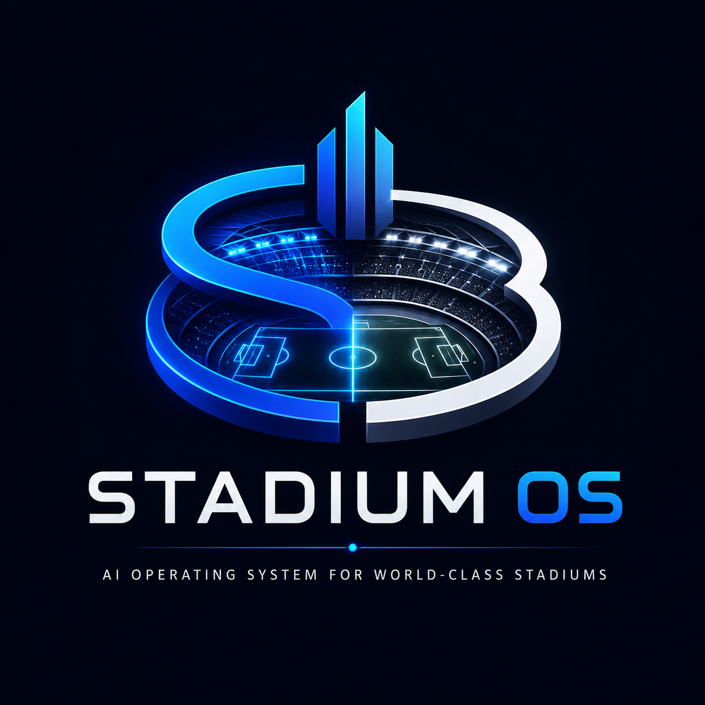
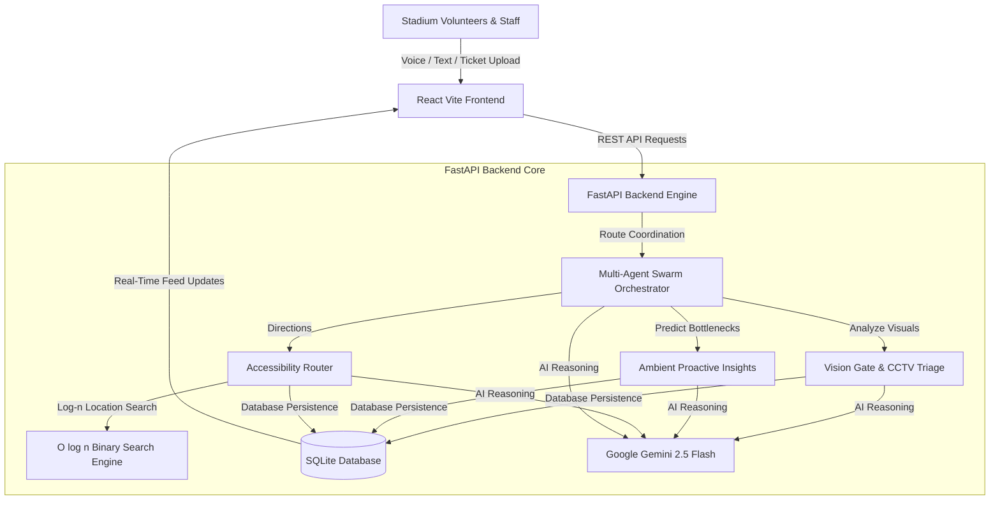
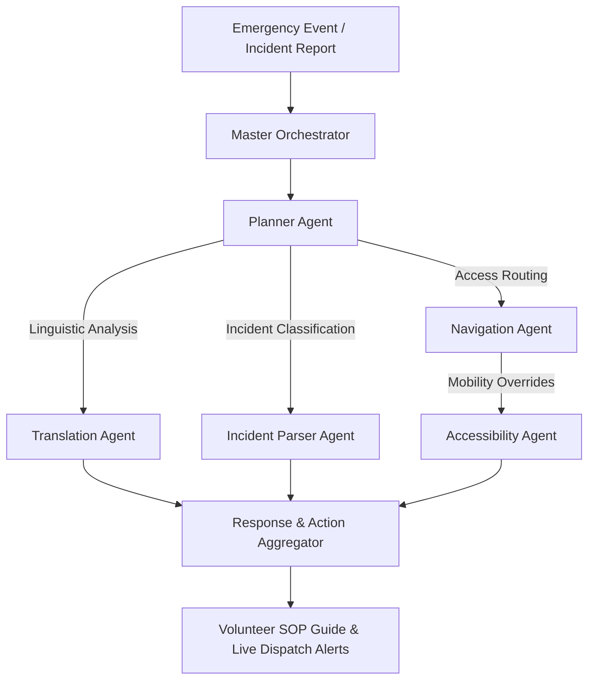

# <p align="center">🏟️ StadiumOS</p>

<p align="center">
  <strong>The AI-Powered Operating System for World-Class Stadiums</strong>
</p>

<p align="center">
  
</p>

<p align="center">
  <a href="https://react.dev/"></a>
  <a href="https://nextjs.org/"></a>
  <a href="https://www.typescriptlang.org/"></a>
  <a href="https://tailwindcss.com/"></a>
  <a href="https://framer.com/motion/"></a>
  <br>
  <a href="https://fastapi.tiangolo.com/"></a>
  <a href="https://www.python.org/"></a>
  <a href="https://openai.com/"></a>
  <a href="https://deepmind.google/technologies/gemini/"></a>
  <a href="https://github.com/langchain-ai/langgraph"></a>
  <br>
  
  
</p>

<p align="center">
  <strong>Built for PromptWars – FIFA World Cup 2026</strong>
</p>

---

## 🔗 Quick Navigation
- [🌐 Live Demo](http://127.0.0.1:5173) &bull; [📹 Demo Video](#) &bull; [📄 Presentation](#) &bull; [📚 Documentation](file:///c:/Users/riyan/webdev/PROMPTWARS_4/README.md)

---

## 📌 Table of Contents
1. [⚠️ Problem Statement](#-problem-statement)
2. [💡 The Solution](#-the-solution)
3. [🧠 Key Features](#-key-features)
4. [🏗️ System Architecture](#-system-architecture)
5. [🤖 Multi-Agent Workflow](#-multi-agent-workflow)
6. [🛠️ Tech Stack](#-tech-stack)
7. [📸 Screenshots](#-screenshots)
8. [🚀 Installation & Setup](#-installation--setup)
9. [📁 Folder Structure](#-folder-structure)
10. [🔑 Environment Variables](#-environment-variables)
11. [🗺️ Future Roadmap](#%EF%B8%8F-future-roadmap)
12. [👥 Contributors & License](#-contributors--license)

---

## ⚠️ Problem Statement

Managing massive stadium events during the **FIFA World Cup 2026** introduces colossal operational friction:
* **Volunteers**: Front-line temporary staff are often young and overwhelmed by chaotic crowd spikes, leading to communication breakdowns and mismanaged incidents.
* **Organizers & Operations**: Command centers struggle to maintain real-time situational awareness, triage security camera alerts, and coordinate diverse on-ground agencies.
* **Venue Staff**: Stressed safety crews are bogged down by manuals and lack unified, explainable routing tools to handle sudden venue bottlenecks.
* **Fans**: Over 80,000 diverse spectators require real-time language translations, step-free access guides, and quick resolutions to seat/ticket disputes.

---

## 💡 The Solution

**StadiumOS** is a next-generation AI-powered digital twin and multi-agent coordination platform. By placing a centralized decision-support cockpit in the hands of front-line volunteers and command center coordinators, StadiumOS automates real-time translation, crowd flow predictions, incident triage, and step-free accessibility navigation. 

It functions as an unbreakable, resilient operating system that connects ground operations, multimodal vision AI, and LLM reasoning into a single glassmorphic dashboard.

---

## 🧠 Key Features

| Feature | Description | Operational Impact |
|:---|:---|:---|
| **🧠 Multi-Agent AI Swarm** | Hierarchical coordination of safety, routing, linguistic, and operations sub-agents. | Orchestrates parallel task execution during multi-dimensional stadium crises. |
| **🌍 Real-Time Translation** | Fan query intent parsing, language detection, and native action playbooks. | Empowers volunteers to speak 8+ languages with immediate suggested response scripts. |
| **📍 Smart Step-Free Route Planner** | Dynamic A* and pathfinding routing based on active venue congestion. | Generates accessibility-friendly, step-free paths for wheelchairs, strollers, and families. |
| **🚨 Multimodal CCTV Video Triage** | Automated analysis of security camera frames using vision AI. | Instantly detects anomalies (crowd surges, medical falls) and dispatches volunteers. |
| **🎟️ Credential & Ticket Validator** | Base64 OCR visual validator that extracts gate, section, and seat codes. | Prevents seat disputes and guides fans directly to their correct sectors. |
| **📊 Proactive Ambient Insights** | Invisible background agent analyzing database logs and weather feeds. | Predicts concourse bottlenecks 15–30 minutes before they occur to adjust staffing. |
| **📈 Crowd Density & CSV Ingestion** | Rapid ingestion of zone capacity records with O(log n) binary search lookup. | Translates raw capacity spikes into clear, Explainable AI (XAI) traffic redirects. |
| **🌱 Accessibility / High-Glare Mode** | Outdoor high-contrast color scheme override for harsh sunlight. | Reduces glare on mobile screens for volunteers standing on open concourses. |

---

## 🏗️ System Architecture

StadiumOS is built using a decoupled React dashboard and a FastAPI backend, communicating via standard REST APIs with local SQLite persistence and external weather integrations.



---

## 🤖 Multi-Agent Workflow

Our Master Orchestrator utilizes a structured cascade flow to resolve incidents and questions. Tasks are analyzed by a planner agent before being delegated to domain-specific sub-agents.



---

## 🛠️ Tech Stack

### Frontend
* **Core**: React 18, Vite, JavaScript (ES6+)
* **Styling**: Vanilla CSS, Glassmorphic variables, High-Contrast Glare Filter Mode
* **Icons**: Lucide React

### Backend
* **Framework**: FastAPI (Asynchronous Python ASGI web server)
* **ASGI Server**: Uvicorn
* **Database**: SQLAlchemy ORM with local SQLite backend
* **Parser Utilities**: PyPDF (PDF Playbook SOP text extraction), Python CSV library

### Artificial Intelligence & Vision
* **LLM Engine**: Google Gemini 2.5 Flash & Google GenAI SDK
* **Multimodal Vision**: OCR and scene segmentation for Ticket Scanning and CCTV footage triage
* **Algorithm**: Optimized $O(\log n)$ Binary Search for high-frequency location lookups

---

## 📸 Screenshots

<details>
  <summary>🔍 Expand to View Dashboard Previews</summary>
  
  ### 🖥️ 1. Modern Glassmorphic Dashboard UI
  *Premium dark theme featuring real-time command center alerts, maps, and translation modules.*
  ```
  [------------------- Dashboard Mockup Placeholder -------------------]
  ```

  ### 🎟️ 2. Multimodal Ticket Scanner
  *OCR scan processing an uploaded ticket, mapping Section 108 Row 12 Seat 5.*
  ```
  [------------------- Ticket Scanner Mockup Placeholder -------------------]
  ```

  ### ♿ 3. Glare-Free High-Contrast Mode
  *Direct sunlight readability filter active for outdoor field volunteers.*
  ```
  [------------------- High Contrast UI Mockup Placeholder -------------------]
  ```
</details>

---

## 🚀 Installation & Setup

### Prerequisites
* **Python**: 3.10+ installed
* **Node.js**: v18+ and `npm` installed

### Step 1: Clone the Repository
```bash
git clone https://github.com/your-username/StadiumOS.git
cd StadiumOS
```

### Step 2: Configure Environment Variables
Create a `.env` file inside the `backend` directory:
```bash
# backend/.env
DATABASE_URL=sqlite:///./stadiumos.db
GEMINI_API_KEY=YOUR_GEMINI_API_KEY_HERE
HOST=127.0.0.1
PORT=8000
```

### Step 3: Run the Concurrent Launcher
The project includes a unified launcher script `run.py` that verifies dependencies, installs missing requirements, initializes the database, and starts both the FastAPI backend and Vite frontend concurrently:
```bash
python run.py
```

* **Frontend Dashboard**: `http://127.0.0.1:5173`
* **Backend REST API**: `http://127.0.0.1:8000`
* **Swagger API Documentation**: `http://127.0.0.1:8000/docs`

---

## 📁 Folder Structure

```text
StadiumOS/
├── backend/
│   ├── app/
│   │   ├── agents/            # GenAI Agents (Swarm, CCTV, Translator, etc)
│   │   │   ├── ambient_proactive.py
│   │   │   ├── cctv_triage.py
│   │   │   ├── crowd_control.py
│   │   │   ├── deescalation.py
│   │   │   ├── incident.py
│   │   │   ├── navigation.py
│   │   │   ├── swarm.py
│   │   │   ├── translator.py
│   │   │   └── vision_gate.py
│   │   ├── config.py          # Environment configs & fallback checks
│   │   ├── db.py              # SQLite session engine
│   │   ├── main.py            # FastAPI main router & endpoints
│   │   ├── models.py          # SQLAlchemy models
│   │   ├── schemas.py         # Pydantic schemas
│   │   ├── seeder.py          # Initial DB seeding script
│   │   └── utils.py           # Binary search utilities
│   ├── tests/                 # Unit & integration testing suites
│   ├── requirements.txt
│   └── .env
├── frontend/
│   ├── public/                # Static public assets (logos, icons)
│   ├── src/
│   │   ├── components/        # React components (Map, Scanner, CCTV, etc)
│   │   ├── App.jsx            # Main React App
│   │   ├── index.css          # Styled design system & CSS overrides
│   │   └── main.jsx
│   ├── package.json
│   └── vite.config.js
├── landing/                   # 3D Three.js Product Landing Page
├── run.py                     # Unified startup launcher
└── README.md                  # Project overview & documentation
```

---

## 🔑 Environment Variables

| Variable | Description | Default | Required |
|:---|:---|:---|:---|
| `GEMINI_API_KEY` | Google Gemini API Credential key. | *None* | **Yes** (to bypass local simulator) |
| `DATABASE_URL` | SQLAlchemy connection string. | `sqlite:///./stadiumos.db` | **No** |
| `HOST` | Backend listener binding host. | `127.0.0.1` | **No** |
| `PORT` | Backend port listener binding. | `8000` | **No** |

---

## 🗺️ Future Roadmap

- [ ] **Wearable HUD Integrations**: Smart watch app supporting instant notifications for volunteers on the move.
- [ ] **Dynamic Queue Modeling**: Predictive wait-time alerts for concession stands using real-time surveillance feed analysis.
- [ ] **Indoor AR Pathfinding**: Augmented Reality step-by-step navigation directly inside the Azteca/MetLife concourses.
- [ ] **Automated Incident Ticket Handshake**: Direct webhook integrations dispatching fire, medical, or security forces with one-click approval.

---

## 👥 Contributors & License

* **StadiumOS Engineering Team** – Built for FIFA World Cup 2026 PromptWars.
* This project is licensed under the **MIT License** - see the `LICENSE` file for details.

---

## 💖 Acknowledgements

* **PromptWars Jury** for organizing the FIFA World Cup 2026 challenge.
* **FastAPI** & **Vite React** for the robust developer foundation.
* **Google DeepMind** for the Gemini SDK and developer tooling.
* **Three.js** & **GSAP** for the premium product visualization landing page.
